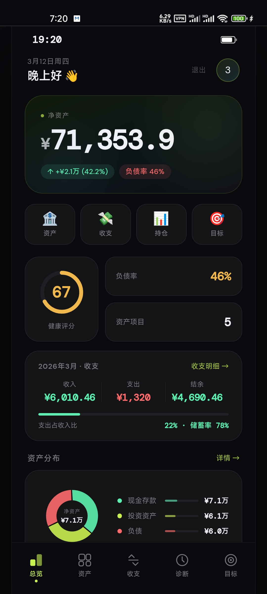
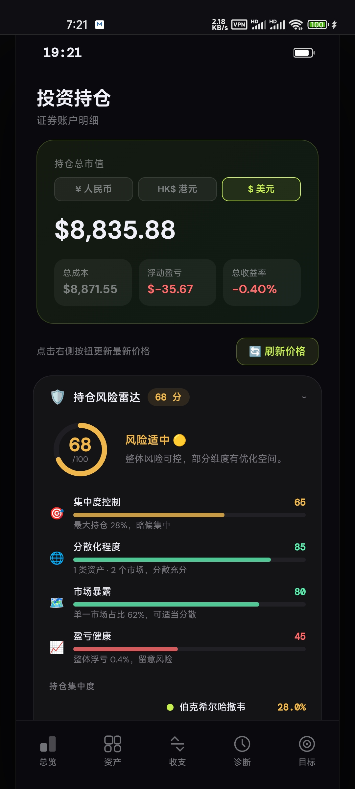

# 💹 财务健康 · Finance Health

> 一款专为个人设计的财务健康管理 PWA，帮助你全面掌握资产、收支、投资与财务目标。

**🌐 在线体验 →** [finance-health-t9vq.vercel.app](https://finance-health-t9vq.vercel.app)

---

## ✨ 功能亮点

| 模块 | 功能描述 |
|------|----------|
| 📊 **总览仪表盘** | 净资产实时展示、资产分布图、净资产趋势折线图、当月收支快照、财务健康评分 |
| 🏦 **资产管理** | 支持现金存款、投资资产、固定资产、负债四大分类，自动计算净资产与负债率 |
| 💸 **收支记录** | 按月管理收入与支出，分类筛选，储蓄率可视化，本月 vs 上月环比对比 |
| 📈 **投资持仓** | 港股/美股/A股持仓追踪，实时价格（Yahoo Finance），三币种汇率切换，风险雷达，压力测试 |
| 🎯 **财务目标** | 设定目标金额与截止日期，关联资产类型，实时追踪完成进度 |
| 📋 **月度预算** | 按支出分类设定预算上限，实时对比实际支出，超支/临近预警 |
| 🩺 **财务诊断** | 多维度健康评分（负债率、多样性、现金流、储蓄率），生成个性化改善建议 |
| 📥 **数据导入** | 支持批量录入收支数据 |

---

## 🛠 技术栈

```
前端        HTML5 / CSS3 / 原生 JavaScript（无框架依赖）
后端        Supabase（PostgreSQL + 实时订阅 + 身份认证）
部署        Vercel（Serverless + 全球 CDN）
PWA         Service Worker + Web Manifest（可安装到桌面/主屏幕）
股票数据    Yahoo Finance API（Vercel Serverless 代理）
汇率数据    Exchange Rate API（1小时缓存）
```

---

## 📱 页面结构

```
index.html        总览仪表盘
assets.html       资产管理
cashflow.html     收支记录
investment.html   投资持仓
goals.html        财务目标
budget.html       月度预算
diagnosis.html    财务诊断
import.html       数据导入
auth.html         登录 / 注册
```

```
js/
  finance.js      纯计算逻辑（calcStats, calcCashflow, calcHealthScore, fmt...）
  db.js           数据库工具层
supabase.js       Supabase 数据层（CRUD，认证，快照）
base.css          全局设计系统（颜色、字体、组件）
api/
  price.js        股票实时价格代理（Vercel Serverless）
  rate.js         汇率代理（Vercel Serverless，1小时缓存）
```

---

## 🗄 数据库结构（Supabase）

```sql
assets            -- 资产记录（type, name, amount, icon）
cashflow          -- 收支记录（type, category, amount, date_month）
net_worth_history -- 净资产历史快照（date_label, net_worth）
goals             -- 财务目标（target_amount, deadline, asset_type）
budgets           -- 月度预算（month, category, amount）
holdings          -- 投资持仓（code, shares, cost_price, current_price）
```

所有表均通过 Supabase Row Level Security（RLS）按 `user_id` 隔离，数据完全私有。

---

## 🚀 本地运行

### 方式一：直接预览（静态文件）

```bash
git clone https://github.com/later33/finance-health-app002
cd finance-health

# 使用 Python 启动本地服务器
python3 -m http.server 8080

# 浏览器访问
open http://localhost:8080
```

### 方式二：完整部署

1. **Fork 本仓库**

2. **创建 Supabase 项目**，执行以下 SQL 建表：

```sql
-- 资产
create table assets (
  id uuid primary key default gen_random_uuid(),
  user_id uuid references auth.users,
  type text, name text, note text,
  amount numeric, icon text,
  created_at timestamptz default now()
);

-- 收支
create table cashflow (
  id uuid primary key default gen_random_uuid(),
  user_id uuid references auth.users,
  type text, category text, name text,
  amount numeric, icon text, date_month text,
  created_at timestamptz default now()
);

-- 净资产历史
create table net_worth_history (
  id uuid primary key default gen_random_uuid(),
  user_id uuid references auth.users,
  date_label varchar(10), net_worth numeric
);

-- 目标
create table goals (
  id uuid primary key default gen_random_uuid(),
  user_id uuid references auth.users,
  emoji text, name text, target_amount numeric,
  deadline text, asset_type text
);

-- 预算
create table budgets (
  id uuid primary key default gen_random_uuid(),
  user_id uuid references auth.users,
  month text, category text, amount numeric
);

-- 持仓
create table holdings (
  id uuid primary key default gen_random_uuid(),
  user_id uuid references auth.users,
  name text, code text, type text,
  shares numeric, cost_price numeric, current_price numeric,
  icon text, note text,
  created_at timestamptz default now()
);
```

3. **配置环境变量**，在 `supabase.js` 中填入你的项目信息：

```javascript
const SUPABASE_URL = 'https://your-project.supabase.co';
const SUPABASE_KEY = 'your-anon-key';
```

4. **部署到 Vercel**，连接 GitHub 仓库，一键部署。

---

## 🎨 设计系统

```css
--bg:           #0a0a0e   /* 主背景 */
--accent:       #c8f050   /* 主强调色（黄绿） */
--ok:           #5cf0b0   /* 正向指标（绿） */
--warn:         #ff6b6b   /* 警告/负向（红） */
--mid:          #f0b84a   /* 中间状态（橙黄） */
--surface:      rgba(255,255,255,0.04)
--text-muted:   rgba(240,240,248,0.45)

字体: DM Sans（正文）+ DM Mono（数字）
```

---

## 📸 截图预览

> *(可替换为你的实际截图)*

| 总览 | 收支 | 持仓 |
|------|------|------|
|  |  |  |

---

## 📄 License

MIT License — 欢迎 Fork 和二次开发。

---

<p align="center">
  Built with ❤️ · Powered by Supabase & Vercel
</p>
